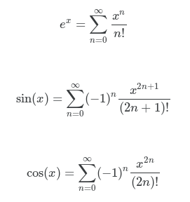
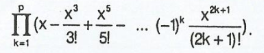
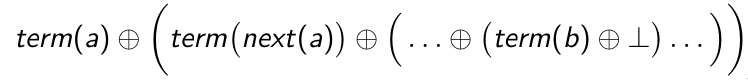
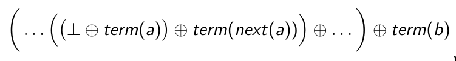
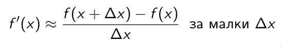

# Упражнение 3 – Функции от по-висок ред. Accumulate

### [Задача 1](01--sum.rkt)
Напишете функция `(sum-step a b next)`, която изчислява сумата на числата `a`, `(next a)`, `(next (next a))`, ..., `b`.

Напишете функция `(sum-term a b term)`, която изчислява сумата на числата `(term a)`, `(term (+ 1 a))`, `(term (+ 1 (+ 1 a)))`, ..., `(term b)`.

Напишете функция `(sum a b term next)`, която изчислява сумата на числата `(term a)`, `(term (next a))`, `(term (next (next a)))`, ..., `(term b)`.

### [Задача 2](02--my-exp.rkt)
Напишете функция `(my-exp m x)`, която изчислява `m`-тата частична сума на функцията `e^x` в точката `x`.

> Гледайки реда на Тейлър за `e^x`, ако заменим безкрайност с `m` получаваме `m`-тата частична сума


### [Задача 3](03--my-sin--my-cos.rkt)
Подобно на задача 2, направете функции `(my-sin m x)` и `(my-cos m x)`, които изчисляват `m`-тите частични суми на `sin(x)` и `cos(x)`.

### [Задача 4](04--product.rkt)
Напишете функция `(product a b term next)`, която изчислява произведението на числата `(term a)`, `(term (next a))`, `(term (next (next a)))`, ..., `(term b)`.

### [Задача 5](05--sprod.rkt)
Напишете функция `(sprod p)`, която изчислява следното произведение:


### [Задача 6](06--accumulate.rkt)
Напишете функцията `(accumulate operation null-value a b term next)`, която пресмята дясно натрупване:


Напишете функцията `(accumulate-i operation null-value a b term next)`, която пресмята ляво натрупване:


### [Задача 7](07--fact-sum-prod.rkt)
Реализирайте функциите `fact`, `sum` и `product` от предишни задачи чрез `accumulate`.

### [Задача 8](08--count-palindromes.rkt)
Напишете функция `(count-palindromes a b)`, която намира колко на брой цели числа палиндроми има в интервала [a, b].

### [Задача 9](09--prime.rkt)
Реализирайте функцията `prime?` чрез `accumulate` или `accumulate-i`

### [Задача 10](10--exists.rkt)
Напишете функция `(exists? pred? a b)`, която проверява дали има цяло число в интервала [a, b], за което предикатът `pred?` е истина.

### [Задача 11](11--forall.rkt)
Напишете функция `(forall? pred? a b)`, която проверява дали за всяко цяло число в интервала [a, b] предикатът `pred?` е истина.

### [Задача 12](12--count-pred.rkt)
Напишете функция `(count-pred pred? a b next)`, която намира колко на брой числа удовлетворяват предиката `pred?` сред числата `a`, `(next a)`, `(next (next a))`, ..., `b`.

### [Задача 13](13--combinations.rkt)
Напишете функция, която намира броя комбинации на `n` елемента, `k`-ти клас.

### [Задача 14](14--variations.rkt)
Напишете функция, която намира броя вариации на `n` елемента, `k`-ти клас.

<hr />

### Задача 15
Напишете функция `(flip f)`, която разменя аргументите на f.
Пример:
```scheme
(expt 2 5) -> 32   (2^5)
((flip expt) 2 5) -> 25   (5^2)
```

### Задача 16
Имайки следните функции
```scheme
(define (twice f x) (f (f x)))
(define (compose f g) (f (g x)))
```

Напишете функция `(repeated f n)` която  връща `n`-кратното прилагане на f.
### Задача 17
Напишете функция `(derive f dx)` която връща производната на f, като знаете, че:


### Задача 18
Напишете функция `(derive-n f n dx)`, която връща `n`-тата производна на f.

