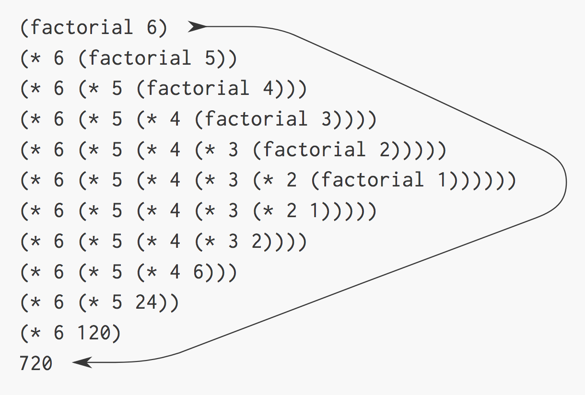
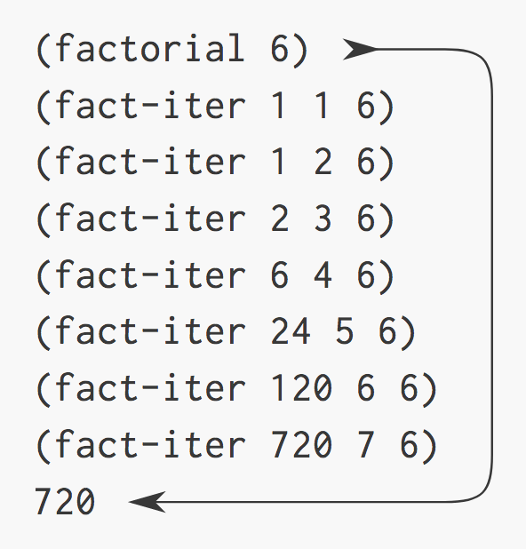

<style type="text/css">
html, body, div, p { font-family: Helvetica; }
</style>

# Линейна рекурсия и итерация

---

# Линейни рекурсивни процеси

## Да разгледаме процедурата `factorial`

```scheme
(define (factorial n)
  (if (<= n 1) 
      1 
      (* n (factorial (- n 1)))))
```

- `factorial` поражда линеен рекурсивен процес
- Top-down подход – за пресмятането на `n!`
  - първо пресмятаме `(n - 1)!`
  - и използваме, че `n! = n * (n - 1)!`

**Въпроси**:
- Но как изглежда един линеен рекурсивен процес?
- Как ще се оцени `(factorial 6)`? 

---

# Линейни рекурсивни процеси

## Визуализация на процеса за `(factorial 6)`



---

# Линейни рекурсивни процеси

## Имаме два основни етапа в изпълнението на процеса:

- разгръщане
  - отлагане на операциите (умноженията)
  - получава се верига от отложени операции
- свиване
  - извършване на операциите (умноженията)

---

# Линейни рекурсивни процеси

- сложност
  - време – O(n)
  - памет – O(n)
- реализация – информацията за състоянието на процеса се пази в стек

---

# Линейни итеративни процеси

- Bottom-up подход – започваме от базата 1 и извършваме последователно следните операции:
```
1. result <– 1
2. result <– result * 2
3. result <– result * 3
...
n. result <– result * n
```
---

# Добре де, не можем ли да напишем просто един `for` ... ?

```c
int factorial(int n) {
  int product = 1;

  for (int counter = 1; counter <= n; ++counter) {
    product = counter * product;
  }

  return product;
}
```

---

# Линейни итеративни процеси

## Да разгледаме процедурите `factorial` и `fact-iter`

```scheme
(define (factorial n)
  (fact-iter 1 1 n))

(define (fact-iter product counter max-count)
  (if (> counter max-count)
      product
      (fact-iter (* counter product)
                 (+ counter 1)
                 max-count)))
```

---

# Линейни итеративни процеси

## Съпоставка с `for` циклите от C

```c
int factorial(int n) {
  int product = 1;

  for (int counter = 1; counter <= n; ++counter) {
    product = counter * product;
  }

  return product;
}
```

```scheme
(define (factorial n)
  (fact-iter 1 1 n))

(define (fact-iter product counter max-count)
  (if (> counter max-count)
      product
      (fact-iter (* counter product)
                 (+ counter 1)
                 max-count)))
```

---

# Линейни итеративни процеси

## Състоянието се представя чрез:

- краен брой променливи на състоянието (state variables)
  - това са аргументите на процедурата: `product`, `counter` и `max-count`
- фиксирано правило за преход към следващото състояние на процеса
  - `product` <– `counter` * `product`
  - `counter` <– `counter` + 1
  - `max-count` <– `max-count`
- краен брой условия за терминиране на процеса
  - `counter` > `max-count`
- можем да продължим процеса от там, където е спрял (докато при линейната рекурсия интерпретатора има част от състоянието)

---

# Линейни итеративни процеси

## Визуализация на процеса за `(factorial 6)`



---

# Линейни итеративни процеси

- сложност
  - време – O(n)
  - памет – O(1)

---

# Влагане на дефиниции

## Скриване на имплементационните детайли

```scheme
(define (factorial n)
  (define (fact-iter product counter max-count)
    (if (> counter max-count)
        product
        (fact-iter (* counter product)
                   (+ counter 1)
                   max-count)))

  (fact-iter 1 1 n))
```

---

# Влагане на дефиниции

- процедурата `fact-iter` е помощна за реализацията на `factorial`
- не е предвидена да бъде използвана от потребителя
- затова можем да я скрием в блока на процедурата `factorial`
- блоковата структура ни помага да организираме програмите, които пишем

---

# Влагане на дефиниции

## Използване на аргументите на външната процедура във вътрешните

```scheme
(define (factorial n)
  (define (fact-iter product counter)
    (if (> counter n)
        product
        (fact-iter (* counter product)
                   (+ counter 1))))

  (fact-iter 1 1))
```

---

# Линейна рекурсия в императивните езици

- В императивните езици като C/C++, Java и други линейната рекурсия използва O(N) памет (stack space)
- Затова в тях съществуват конструкции за линейна итерация като `for`, `while`, `do`, `repeat`, `until`, etc.
- Видяхме, че линейната рекурсия, може да се сведе до линеен итеративен процес.

---

# Tail-call optimization

- Ако функция връща директно извикване към друга функция (може и същата), то тя може да се сведе към **линеен итеративен процес** и да използва O(1) памет

```scheme
(define (factorial n)
  (define (fact-iter product counter)
    (if (> counter n)
        product
        (fact-iter (* counter product)
                   (+ counter 1))))

  (fact-iter 1 1))
```

- Оптимизацията се поддържа от компилатори/интерпретатори на някои езици като C++, JS и Scheme, разбира се. Засега за Java няма.

---

# Кое е опашкова рекурсия и кое не? Защо?

```scheme
(define (f x)
  (if (= x 0)
      (+ (f (- x 1)) 1)
      x))
```


```scheme
(define (f x i)
  (if (> i 0)
      (f (+ x 1) (- i 1))
      x))
```
