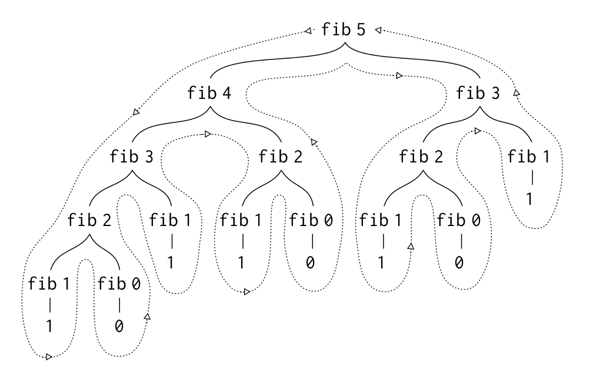

<style type="text/css">
html, body, div, p { font-family: Helvetica; }
</style>

# Линейна рекурсия

Решаваме <u>**един**</u> по-малък подпроблем.
Построяваме решението на големия проблем, комбинирайки решението на подпроблема.

`n! = n * (n - 1)!`

`sum([a1, a2, ..., aN]) = a1 + sum([a2, ..., aN])`

---

# Дървовидна рекурсия


<u>**Разделяме**</u> и решаваме <u>**2 или повече**</u> по-малки подпроблема.
Построяваме решението на големия проблем, <u>**комбинирайки**</u> решенията на подпроблемите.

```
fib(n) = fib(n - 1) + fib(n - 2)
```

```
f(n, k) = 42 + max(f(n - 1, k) + 1,
		   f(n, k - 1) + 2)
```

---


# Дървовидна рекурсия


<u>**Разделяме**</u> и решаваме <u>**2 или повече**</u> по-малки подпроблема.
Построяваме решението на големия проблем, <u>**комбинирайки**</u> решенията на подпроблемите.

```
fib(0) = 0
fib(1) = 1
fib(n) = fib(n - 1) + fib(n - 2)
```

```
f(0, 0) = 2
f(0, 1) = 1
f(1, 0) = 3
f(n, k) = 42 + max(f(n - 1, k) + 1,
		   f(n, k - 1) + 2)
```

---

# Разделяй и владей


---

# (fib 5)


