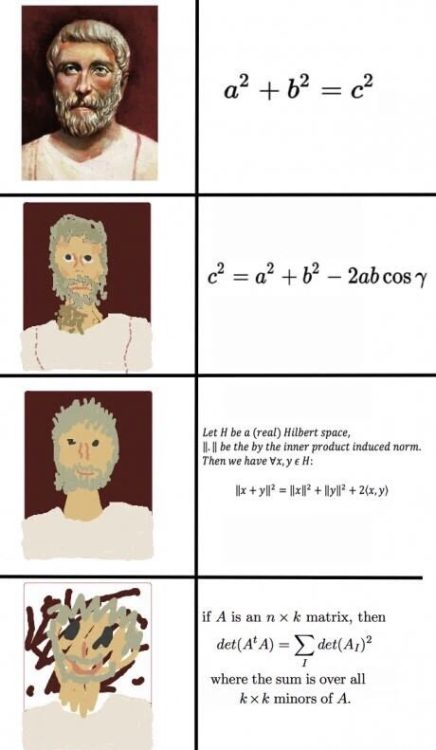
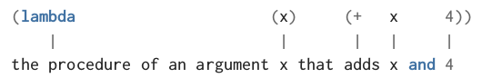

<style type="text/css">
html, body, div, p { font-family: Helvetica; }
</style>

# Процедури от по-висок ред

---

# Сума

$$\sum_{x = a}^b x$$

---

# Сума... на целите числа

$$\sum_{x = a}^b x$$

```scheme
(define (sum-integers a b)
  (if (> a b)
      0
      (+ a
         (sum-integers (+ a 1) b))))
```

---

# Сума... на квадратите

$$\sum_{x = a}^b x^2$$

```scheme
(define (sum-squares a b)
  (if (> a b)
      0
      (+ ...
         (sum-squares (+ a 1) b))))
```

---

# Сума... на квадратите

$$\sum_{x = a}^b x^2$$

```scheme
(define (sum-squares a b)
  (if (> a b)
      0
      (+ (square a)
         (sum-squares (+ a 1) b))))
```

---

# Сума... на дроби

$$\sum_{x = a}^b \frac{1}{x^4 + 1}$$

```scheme
(define (sum-fractions a b)
  (if (> a b)
      0
      (+ ...
         (sum-fractions (+ a 1) b))))
```

---

# Сума... на дроби

$$\sum_{x = a}^b \frac{1}{x^4 + 1}$$

```scheme
(define (sum-fractions a b)
  (if (> a b)
      0
      (+ (/ 1
            (+ (square (square a)) 1))
         (sum-fractions (+ a 1) b))))
```

---

# Обобщение

$$
\sum_{x = a}^b x

\qquad

\sum_{x = a}^b x^2

\qquad

\sum_{x = a}^b \frac{1}{x^4 + 1}

\qquad
\cdots
\qquad
\qquad
\qquad
$$

---

# Обобщение

$$
\sum_{x = a}^b x

\qquad

\sum_{x = a}^b x^2

\qquad

\sum_{x = a}^b \frac{1}{x^4 + 1}

\qquad
\cdots
\qquad

\sum_{x = a}^b f(x)
$$

---

# По-абстрактна сума

$$\sum_{x = a}^b f(x)$$

```scheme
(define (sum f a b)
  (if (> a b)
      0
      (+ (f a)
         (sum f (+ a 1) b))))
```

---


# По-абстрактна сума

$$\sum_{x = a}^b term(x)$$

```scheme
(define (sum term a b)
  (if (> a b)
      0
      (+ (term a)
         (sum term (+ a 1) b))))
```

---

# По-абстрактна сума

```scheme
(define (identity x) x)

(define (sum-integers a b)
  (sum identity a b))
```

```scheme
(define (square x) (* x x))

(define (sum-squares a b)
  (sum square a b))
```

```scheme
(define (cube x) (* x x x))

(define (sum-cubes a b)
  (sum cube a b))
```

```scheme
(define (sum-fractions a b)
  (define (term x)
    (/ 1
       (+ (square (square x)) 1)))

  (sum term a b))
```

---

# Произведение

$$\prod_{x = a}^b f(x)$$

---

# Произведение

$$\prod_{x = a}^b term(x)$$

```scheme
(define (product term a b)
  (if (> a b)
      0
      (* (term a)
         (product term (+ a 1) b))))
```

---

# (* Произведение 0) ?

```scheme
(define (identity x) x)

(product identity 1 5) ; 0
```

```scheme
(define (square x) (* x x))

(product square 2 3) ; 0
```

```scheme
(define (identity x) x)

(define (factorial n)
  (product identity 1 n))
```

---

# (* Произведение 1)

$$\prod_{x = a}^b term(x)$$

```scheme
(define (product term a b)
  (if (> a b)
      1
      (* (f a)
         (product term (+ a 1) b))))
```

---


---

# Още по-абстрактно

$$
\sum_{x = a}^b f(x)
\qquad
\prod_{x = a}^b f(x)
\qquad
\bigwedge\limits_{x = a}^b f(x)
\qquad
\cdots
$$

```scheme
(define (accumulate combiner null-value term a b)
  (if (> a b)
      null-value
      (combiner (term a)
                (accumulate combiner
                            null-value
                            term
                            (+ a 1)
                            b))))
```

---

# От частното към общото



---

# Да дефинираме `sum` и `product` чрез `accumulate`

```scheme
(define (sum term a b)
  (accumulate + 0 term a b))

(define (product term a b)
  (accumulate * 1 term a b))
```

---

# Или нещо по-конкретно

```scheme
(define (square x) (* x x))

(define (sum-squares a b)
  (accumulate + 0 square a b))
```

```scheme
(define (cube x) (* x x x))

(define (product-cubes a b)
  (accumulate * 1 cube a b))
```

```scheme
(define (average x y) ; бинарна процедура
  (/ (+ x y) 2))

(define (identity x) x)

(define (fractions a b)
  (accumulate average 0 identity a b))
```

---

# λ
## Създаване на процедури чрез `lambda`

```scheme
(define (square x) (* x x))
```

```scheme
(define square (lambda (x) (* x x)))
```

```scheme
(sum 1 5 square) ; 55
```

```scheme
(sum 1 5 (lambda (x) x)) ; 15
```

---

# λ
## Как да четем lambda




