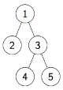

Дървета
=======

**def. Двоично дърво** е празният списък (`'()`) или вложен списък от три
елемента: `'(<корен> <ляво> . <дясно>)`, където `<корен>` е корена на двоичното
дърво, `<ляво>` е лявото поддърво, а `<дясно>` е дясното поддърво на довичното
дърво.

Пример:
```scheme
'(1 (2 () ())
    (3 (4 () ())
        (5 () ())))
```



Задачи
------

1. Да се дефинират следните основни процедури за работа с двоични дървета:
    - `(make-tree root left right)` - конструира двоично дърво по корен,
ляво и дясно поддърво.
    - `(root-tree tree)` - връща корена на двоичното дърво `tree`.
    - `(left-tree tree)` - връща лявото поддърво на двоичното дърво `tree`.
    - `(right-tree tree)` - връща дясното поддърво на двоичното дърво `tree`.
    - `(empty-tree? tree)` - проверява дали двоичното дърво `tree` е празно.
    - `(leaf-tree? tree)` - проверява дали `tree` е листо.
    - `(tree? tree)` - проверява дали `tree` е двоично дърво.

1. Да се дефинират функции `(pre-order tree)`, `(in-order tree)` и
`(post-order tree)`, които правят съответно корен-ляво-дясно,
ляво-корен-дясно и ляво-дясно-корен обхождане на двоичното дървото `tree`.
Функциите да връщат списък от върховете на `tree` в реда на тяхното обхождане.

1. Ниво `n` в двоично дърво наричаме списък от всички върхове на
двоичното дърво, които са на разстояние `n` от корена. Ниво 0 съдържа само
корена на дървото. Да се дефинира функция `(level n tree)`, която връща `n`-тото
ниво в двоичното дърво `tree`.

1. Да се дефинира функция `(count-leaves tree)`, която намира броя на листата
в двоичното дърво `tree`.

1. Да се дефинира функция `(map-tree f tree)`, която прилага функцията `f` над
всеки връх на двоичното дърво `tree`.

1. Да се дефинира функция `(height tree)`, която
намира височината на двоичното дърво `tree`.

1. Да се дефинира функция `(sum-tree tree)`, която
намира сумата на всички върхове в двоичното дърво `tree`.

1. Да се дефинира функция `(max-tree tree)`, която
намира максималната стойност в двоичното дърво `tree`.

1. Да се дефинира функция `(invert tree)`, която
връща огледалния образ на двоичното дърво `tree`.

    Например:
    ```
        4               4
       / \   invert    / \
      2   5 ========> 5   2
     / \                 / \
    1   3               3   1
    ```

1. Двоична пирамида е празното двоично дърво или е двоично дърво, в което всеки
връх е по-малък от децата си. Да се напише предикат `(binary-heap? tree)`, която
проверява дали дървото `tree` е двоична пирамида.

1. Двоично дърво е балансирано, ако:
    1. е празното двоично дърво или
    2. височините на лявото и дясното поддърво се различават най-много с 1 и
    лявото и дясното поддървета са балансирани.

    Да се напише предикат `(balanced? tree)`, която
    проверява дали дървото `tree` е балансирано.

1. Двоично **наредено** дърво е:
   1. празното двоично дърво или
   2. двоично дърво, в което коренът е:
      - по-голям от левия си наследник,
      - по-малък или равен на десния си наследник и
      - двете поддървета са двоични наредени.

    Да се напише предикат `(binary-search-tree? tree)`, която
    проверява дали дървото `tree` е двоично наредено дърво.

1. Напишете функция `(binary-serach-tree-insert tree v)`, която
вмъква върха `v` в двоичното наредено дърво `tree`.
Новополученото дърво трябва да бъде двоично наредено.

1. Напишете функция `(tree-sort l)`, която сортира списъка `l`, използвайки
двоично наредено дърво.

1. Напишете функция `(to-balanced-tree l)`, която създава
**балансирано** двоично **наредено** дърво от сортирания списък `l`.
