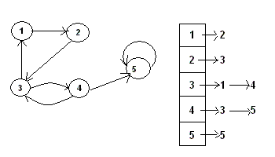

Графи
-----

1. Да се дефинират следните основни функции за работа с графи, представени
чрез асоциативен списък (ключовете са върховете в графа, а стойностите са
списъци от техните деца):
    - `(vertices g)` - връща списък от върховете в графа `g`.
    - `(children v g)` - връща списък от децата на върха `v` в графа `g`.
    - `(edge? u v g)` - проверява дали има ребро от върха `u` до върха `v` в графа `g`.
    - `(map-children v f g)` - прилага функцията `f` върху всяко дете на върха `v` в графа `g`.
    - `(search-child v p g)` - проверява дали съществува дете на върха `v`
    в графа `g`, което удовлетворява предиката `p`.

1. Да се дефинира функция `path(graph, u, v)`, която
намира път от върха `u` до върха `v` в графа `graph`.

    Например, ако представяме графът чрез списък на съседство:
    ```scheme
    (define g '((1 2) (2 3) (3 1 4) (4 3 5) (5 5)))
    (path g 1 4) ; връща '(1 2 3 4)
    ```



1. Да се дефинира функция `(shortest-path graph u v)`, която
намира най-късия път от върха `u` до върха `v` в графа `graph`.

1. Да се дефинира предикат `(acyclic? graph)`, който
проверява дали графът `graph` е ацикличен.
