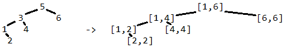

Задачи за подготовка за изпит
=============================

## 2016

#### Вариант А

**Задача 1. (10 т.)** Да се напише функция findColumns, която по дадена матрица от числа намира броя на колоните, за които е вярно, че всичките им елементи се срещат в някой от редовете на матрицата.

Пример:

```haskell
findColumns [[1,4,3],[4,5,6],[7,4,9]] → 1
```

**Задача 2. (15 т.)** Ако f и g са унарни числови функции, а h е бинарна числова функция, то дефинираме функцията f{h}g по следния начин: (f{h}g) (x) := h(f(x),g(x)). Дадени са две цели числа a < b и два списъка uns и bins, съответно с унарни и бинарни функции. Да се напише функция check, която проверява дали има такива функции f и g от списъка uns и h от списъка bins така, че f{h}g да съвпада с някоя от функциите в uns върху всички цели числа в интервала [a;b].
Упътване: използвайте помощна функция от по-висок ред combine, която по дадени f, g и h връща така дефинираната f{h}g.

Пример:

```haskell
check 1 9 [(+1),(-1),(-1).(^2)] [(*)] → True
```

**Задача 3. (15 т.)** Растение се описва с наредена тройка от име (низ), минимална и максимална температура, в която вирее (цели числа градуси). Да се напише функция garden, която по списък от растения намира интервал от стойности на температура, в който максимален брой растения могат да виреят, заедно с имената на тези растения.

Пример:

```haskell
garden[("peas",5,25),("beans",3,15),("cocoa",20,30)] → ((20,25),["peas","cocoa"])
```

**Задача 4. (15 т.)** Даден е граф g, представен със списък от наследници и връх u в графа. Да се напише функция maxPath, която намира най-дългия ацикличен път в g, започващ от върха u.

Пример:

```haskell
maxPath [[1,2,4],[2,3],[3,2],[4]] 1 → [1,2,3]
```

#### Вариант Б

**Задача 1. (10 т.)** Да се напише функция hasColumn, която по дадена матрица от числа проверява има ли в нея колона, в която всяко число се среща във всеки един от редовете на матрицата.

Пример:

```haskell
hasColumn [[1,2,3],[2,3,4],[5,3,2]] → True
```

**Задача 2. (15 т.)** Ако f и g са бинарни числови функции, а h е унарна числова функция, то дефинираме функцията f—g→h по следния начин: (f—g→h) (x) := f(x,g(x,h(x)). Дадени са две цели числа a < b и два списъка uns и bins, съответно с унарни и бинарни функции. Да се напише функция check, която проверява дали има такива функции f и g от списъка bins и h от списъка uns така, че f—g→h да съвпада с някоя от функциите в uns върху всички цели числа в интервала [a;b].
Упътване: използвайте помощна функция от по-висок ред combine, която по дадени f, g и h връща така дефинираната f—g→h.

Пример:

```haskell
check 1 9 [(+2),(-2)] [(+),(-)] → True
```

**Задача 3. (15 т.)** Спектакъл се описва с наредена тройка от име (низ), начален кръгъл час (от 0 до 23) и брой минути, които продължава (от 1 до 300). Да се напише функция showtime която по списък от спектакли в един и същ ден намира в кой едночасов интервал протичат максимален брой спектакли, колко минути продължава засичането и кои са имената засичащите се спектакли.

Пример:

```haskell
showtime [("Cats",21,130),("Rent",19,100), ("Hair",22,90)] → ((22,70),["Cats","Hair"])
```

**Задача 4. (15 т.)** Даден е граф g, представен със списък от наследници. Да се напише функция maxCycle намери най-дългият прост цикъл в g, включващ даден връх u. Упътване: прост цикъл наричаме път в който само първият и последният връх съвпадат.

Пример:

```haskell
maxCycle [[1,2],[2,3],[3,1,4],[4,2]] 1 → [1,2,3,1]
```

## 2017

#### Вариант А

**Задача 1 (12 т.).** Да се напише функция largestInterval, която получава като аргументи две едноместни целочислени функции f и g и две цели числа a и b. Функцията трябва да намира най-големия целочислен подинтервал на [a, b] такъв, че двете функции дават еднакви стойности за всяко цяло число в него.

Пример:

```haskell
largestInterval (\x -> x) (\x -> x*x) 0 3 -> (0, 1)
```

**Задача 2. (16 т.)** Да се напише функция intervalTree, която преобразува двоично дърво от числа в ново дърво със същата структура, в което стойността във всеки възел е заменена с наредена двойка, представляваща най-малкия интервал, съдържащ всички стойности в съответното поддърво. Представянето на дървото е по

Пример:


**Бонус (4 т.):** intervalTree да работи за време O(n) в най-лошия случай.

**Задача 3. (10 т.)** Да се генерира поток sumsOfSquares от тези числа, които са сума от квадратите на две положителни цели числа.

**Задача 4. (12 т.)** Видеоклип се представя с име (низ) и дължина (брой секунди). Да се напише функция averageVideo, която по непразен списък от видеоклипове намира името на този, който е с дължина най-близка до средната дължина на всички видеоклипове в списъка, без да я надхвърля.

Пример:

```haskell
averageVideo [("lolcat", 15), ("dogewow", 35), ("omgseethis", 28)] → "lolcat"
```

#### Вариант Б

**Задача 1. (12 т.)** Да се напише функция countIntervals, която получава като аргументи две едноместни целочислени функции f и g и две цели числа a и b. Функцията трябва да намира броя на всички непразни целочислени подинтервали на [a, b], в които да няма цяло число, за което функциите да дават еднакви стойности.

Пример:

```haskell
countIntervals (\x -> x) (\x -> x*x) 0 3 -> 3
```

Интервалите са [2, 2], [2, 3] и [3, 3].

**Задача 2. (16 т.)** Да се напише функция pairTree, която преобразува двоично дърво от числа в ново дърво със същата структура, в което стойността във всеки възел е заменена с наредена двойка, представляваща най-малката стойност в лявото поддърво на съответния възел (включително и самия възел) и най-голямата стойност в дясното поддърво на съответния възел (включително и самия възел).

Пример:


**Бонус (4 т.):** pairTree да работи за време O(n) в най-лошия случай.

**Задача 3. (10 т.)** Да се генерира поток sumsOfCubes от тези числа, които са сума от кубовете на две положителни цели числа.

**Задача 4. (12 т.)** Чифт обувки се представят с модел (низ) и номер (цяло число). Да се напише функция bestRange, която по даден непразен списък от чифтове намира модел обувки, от който има максимален брой различни номера.

Пример:

```haskell
bestRange [("boots", 38), ("sandals", 41), ("boots", 38), ("sandals", 43)] → "sandals"
```

## 2018

#### Вариант А

**Задача 1. (10 т.)** Да се напише функция, generateExponents, която по дадени различни естествени числа k и l, генерира безкрайния поток от всички числа от вида x <sup>k</sup> y <sup>l</sup>, без повторения и подредени в нарастващ ред.

Пример:

```haskell
generateExponents 2 3 → [1, 4, 8, 9, 16, 25, 27, ... ]
```

**Задача 2. (10 т.)** Път от корен до възел в двоично дърво кодираме с поредица от цифри 0 и 1, която започва с цифрата 1, а за всяка следваща цифра 0 означава завиване по левия клон, а 1 — по десния. Да се реализира функция sameAsCode, която в двоично дърво от числа връща такова число x, което съвпада по стойност с двоичното число, кодиращо пътя от корена до x, или 0, ако такова число няма. Представянето на дървото е по ваш избор.

Пример:

```scheme
(sameAsCode '(5 (3 () (2 () ())) (4 (6 () ()) ()))) → 6
```

**Задача 3. (12 т.)** Дадени са списък от n списъци от числа l1, …, ln и списък от n функции f1, …, fn. Да се реализира функция allEqual, която връща списък x1, …, xn, където xi ∈ li и fi(xi) са еднакви по стойност. В случай, че такива xi не съществуват, функцията да връща празния списък.

Пример:

```haskell
allEqual [[1,2], [3,4], [5,6]] [(+1), id, (8-)] → [2,3,5]
```

**Задача 4.** Лекарство се задава със наредена двойка от име (низ) и списък от активни съставки, зададени като наредени двойки от име (низ) и количество в мг (цяло число). Казваме, че лекарството A е заместител на лекарството B, ако A има точно същите активни съставки като B в същата пропорция.

1. **(4 т.)** Да се реализира функция isSubstitute, която по две дадени лекарства проверява дали едното е заместител на другото.
1. **(6 т.)** Да се реализира функция bestSubstitutes, която по лекарство A и списък от лекарства L намира името на "най-добрия" заместител на A в L, чиито активни съставки са най-близки по количество до тези на A, без да ги надхвърлят, или празният низ, ако такъв няма.
1. **(8 т.)** Да се реализира функция groupSubstitutes, по даден списък от лекарства ги групира по “заместителство”, т.е. връща списък от списъци от лекарства, където всички лекарства в даден списък са заместители един на друг.

Пример:

```haskell
l = [("A",[("p",6),("q",9)]),("B",[("p",2),("q",3)]),("C",[("p",3)])]
isSubstitute (l!!0) (l!!1) → True
bestSubstitute (l!!0) (tail l) → "B"
groupSubstitutes l → [[("A",...),("B",...)],[("C",...)]]
```

#### Вариант Б

**Задача 1. (10 т.)** Да се напише функция generatePowers, която по дадени различни естествени числа k, l ≥ 2, генерира безкрайния поток от всички числа от вида k <sup>x</sup> l <sup>y</sup>, без повторения и подредени в нарастващ ред.

Пример:

```haskell
generatePowers 2 3 → [1, 2, 3, 4, 6, 8, 9, ... ]
```

**Задача 2. (10 т.)** Път от корен до възел в двоично дърво кодираме с поредица от цифри 0 и 1, която започва с цифрата 1, а за всяка следваща цифра 0 означава завиване по левия клон, а 1 — по десния. Да се реализира функция countCodes, която в двоично дърво от числа намира броя на числата x, които съвпадат по стойност с двоичното число, кодиращо пътя от корена до x. Представянето на дървото е по ваш избор.

Пример:

```scheme
(countCodes '(1 (2 () (3 () ()) (4 (6 () ()) ()))) → 3
```

**Задача 3. (12 т.)** Даден е списък от n списъци от числа l1, …, ln и списък от n функции f1, …, fn. Да се реализира функция aProg, която връща списък x1, …, xn, където xi ∈ li и f1(x1), f2(x2), ... fn(xn) образуват аритметична прогресия. В случай, че такива xi не съществуват, функцията да връща празния списък.

Пример:

```haskell
aProg [[1,2], [3,4], [5,7]] [(+3), id, (7-)] → [1, 3, 5]
```

**Задача 4.** Лекарство се задава със наредена двойка от име (низ) и списък от активни съставки, зададени като наредени двойки от име (низ) и количество в мг (цяло число). Казваме, че лекарството A е по-силно от лекарството B, ако A има всички активни съставки на B (евентуално и още други) в поне същите количества, като поне една от съставките е в по-голямо количество.

1. **(4 т.)** Да се реализира функция isStronger, която по две дадени лекарства проверява дали първото е по-силно от второто.
1. **(6 т.)** Да се реализира функция leastStronger, която по лекарство A и списък от лекарства L намира името на лекарство B, което е по-силно от A и сумата от разликите в количествата на активните съставки на B и A е възможно най-малка, или празният низ, ако такова няма.
1. **(8 т.)** Да се реализира функция strongRelation, която по списък от лекарства L връща списък от наредени двойки от лекарство и списък от имена на лекарства в L, които са по-силни от него.

Пример:

```haskell
 l = [("A",[("p",5),("q",3)]),("B",[("p",4),("q",3)]),("C",[("p",3)])]
isStronger (l!!0) (l!!1) → True
leastStronger (l!!2) l → "B"
strongRelation l → [(("A",...),[]),(("B",...),["A"]),(("C",...),["A","B"])]
```
