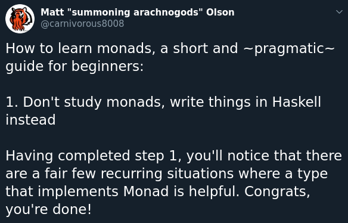

## Упражнения на дисциплината "Функционално Програмиране - Практикум"

### Полезна информация

##### Курсът се взима с домашни + проект
Домашните не са задължителни, проектът е.

Домашните ще са ~7 на брой, в идеален свят.

Домашните ще се предават в лично github репо за всеки човек
чрез pull request. На pull request-а ще му бъдат пускани автоматични тестове
(и евентуално `-Wall` и линтър по-натататък).

Проектът ще може да е споделен с проекта за главната дисциплина, с уговорката че правите проект за >=40 точки.

##### Контакти

* Mail - godzbanebane@gmail.com
* Twitter/FB/Messenger - Georgi Lyubenov (@googleson78)

Ще ползваме discord-а, който е споделен с останалите групи по ФП, за обявления за домашни, така че очаквам да го следите.

Ако искате да обсъждате нещо от философски въпроси до конкретни неща, в discord ще е най-яко,
защото могат всички да го гледат и да се включват.

**Важно** - За линк към дискорда ми пишете мейл, предпочитам да не слагам публичен такъв на произволни места из нета.

#### Haskell ресурси

* Плагиатствам от [този курс](https://github.com/bobatkey/CS316-19)
* [Книгата](http://www.cs.nott.ac.uk/~pszgmh/pih.html) на която е базиран горният курс (и също я смятам за добър ресурс)
* Хубав talk/demo за неща които често ти се налагат често и как се правят те в Haskell - [цък](https://www.youtube.com/watch?v=idU7GdlfP9Q)
* [Hoogle](https://hoogle.haskell.org/) - търсене за хаскел функции(идентификатори) (по типове!)
* [Hackage](http://hackage.haskell.org/) - търсене за хаскел пакети
* [LYAH](http://learnyouahaskell.com/) - може би най-популярният `Haskell` ресурс

  Става за бързо четене, но малко остаряло + няма задачи/повече примери.
  (има готини илюстрации)

* [Real World Haskell](http://book.realworldhaskell.org/) - практично насочена

  Отново, малко остаряло.
* Специализирани ресурси:

  * Мазохизъм/Програмиране с типове - [Thinking with Types](https://thinkingwithtypes.com/)
  * Паралелно и конкуретно програмиране - [Parallel and Concurrent Programming in Haskell](https://simonmar.github.io/pages/pcph.html)
  * Разглеждане на фундаментални типови класове - [Typeclassopedia](https://wiki.haskell.org/Typeclassopedia)
  * Разглеждане на различни интересни библиотеки/разшиерния на езика - [24 days of *](https://ocharles.org.uk/)
  * Хиляди статии по най-различни теми - питайте ме ако ви е интересно - не се четат трудно!

* Яки misc неща (TODO: add more stuff?):

  * Twitter - почти всички Haskell/Programming language/Type theory хора са там
  * https://www.haskellcast.com/ - първите няколко епизода много ме зарибиха
  * https://kowainik.github.io/posts
  * https://reasonablypolymorphic.com/

* Монади:

##### Misc
* [Упражненията ми/домашни от миналата година](https://github.com/googleson78/fp-pract1819)

* Ходете на лекции! Трифон говори доста фундаментални и интересни неща!

* TODO(Georgi): prepare polls for rating class??
